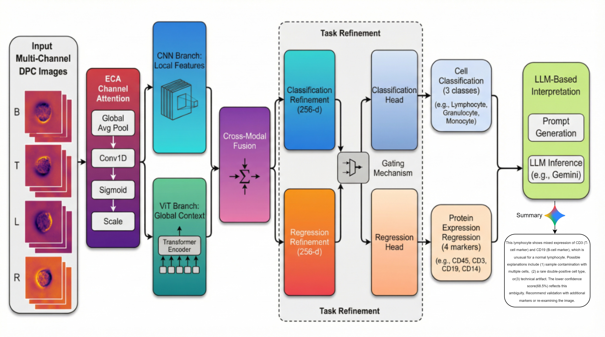

# Towards Label-Free Single-Cell Phenotyping Using Multi-Task Learning

**ICPR 2026** | [arXiv:2605.14717](https://arxiv.org/abs/2605.14717)

> **Saqib Nazir** and **Ardhendu Behera**  
> Department of Computer Science, Edge Hill University, UK  
> {Saqib.Nazir1993@gmail.com}

---

## Overview

We present a unified deep learning framework that jointly performs **White Blood Cell (WBC) classification** and **continuous protein-expression regression** from label-free Differential Phase Contrast (DPC) microscopy images — without fluorescent staining.

**Key contributions:**

1. **Hybrid CNN-ViT architecture** fusing local texture features (CNN with Inception modules) and global spatial dependencies (lightweight ViT) via learnable cross-modal fusion
2. **Multi-task learning** that simultaneously predicts discrete cell type and continuous protein-expression levels (CD45, CD3, CD19, CD14)
3. **Task-adaptive gating** enabling controllable, sample-adaptive information exchange between classification and regression pathways
4. **LLM interpretability** module that converts predictions into biologically grounded natural-language summaries

**Results on BSCCM dataset:** 91.3% WBC classification accuracy, 0.73 Pearson correlation for CD16 regression  
**Results on BCCD benchmark:** 93.77% classification accuracy

---

## Architecture



```
Input: (B, 4, 28, 28)  ← 4-channel DPC (Left, Right, Top, Bottom)
    │
    └─ Shared ECA Channel Attention
           ├─ CNN Branch: Stem → Inception×2 → (B, 196, 192)
           └─ ViT Branch: Patch(4×4) → Transformer×2 → (B, 50, 128)
                  │
                  └─ Cross-Modal Fusion → (B, 256)
                         ├─ Task-Specific Refinement
                         └─ Task Gating (learnable cross-task exchange)
                                ├─ Classification Head → (B, 3)  [Lymphocyte | Granulocyte | Monocyte]
                                └─ Regression Head    → (B, 4)  [CD45 | CD3 | CD19 | CD14]
```

**Model size:** ~12M parameters, ~0.8 GFLOPs per image (real-time capable)

---

## Installation

```bash
git clone https://github.com/saqibnaziir/Single-Cell-Phenotyping.git
cd Single-Cell-Phenotyping
pip install -r requirements.txt
```

### Dataset

Download the BSCCM dataset (BSCCMNIST variant):
```bash
pip install bsccm
python -c "from bsccm import download_dataset; download_dataset('./data', mnist=True)"
```

The BCCD benchmark can be obtained from [Kaggle: Blood Cell Images](https://www.kaggle.com/datasets/paultimothymooney/blood-cells).

---

## Pre-trained Models

[](https://huggingface.co/saqialii/single-cell-phenotyping)

Pre-trained checkpoints are available on the [Hugging Face Hub](https://huggingface.co/saqialii/single-cell-phenotyping):

| Checkpoint | Dataset | WBC Acc | Pearson r (CD16) |
|---|---|---|---|
| `bsccm_best_model.pth` | BSCCM | **91.3%** | **0.73** |
| `bccd_best_model.pth` | BCCD | **93.77%** | — |

### Download & Load

```python
from huggingface_hub import hf_hub_download
import torch
from model import create_model

# Download checkpoint (cached automatically after first download)
ckpt_path = hf_hub_download(
    repo_id="saqialii/single-cell-phenotyping",
    filename="bsccm_best_model.pth"
)

# Load model
model = create_model(num_classes=3, num_proteins=4)
checkpoint = torch.load(ckpt_path, map_location="cpu")
model.load_state_dict(checkpoint["model_state_dict"])
model.eval()
```

Install the Hugging Face Hub client if not already present:
```bash
pip install huggingface_hub
```

---

## Usage

### 1. Training

```bash
python train.py \
    --data_path ./data/BSCCMNIST \
    --save_dir checkpoints/run1 \
    --num_epochs 200 \
    --batch_size 32 \
    --learning_rate 5e-5
```

With optional Weights & Biases logging:
```bash
python train.py --data_path ./data/BSCCMNIST --use_wandb
```

Key arguments:

| Argument | Default | Description |
|---|---|---|
| `--data_path` | required | Path to BSCCMNIST directory |
| `--num_epochs` | 200 | Maximum training epochs |
| `--batch_size` | 32 | Training batch size |
| `--learning_rate` | 5e-5 | Initial learning rate |
| `--patience` | 30 | Early-stopping patience |
| `--cls_weight` | 1.0 | Classification loss weight |
| `--reg_weight` | 0.5 | Regression loss weight |
| `--save_dir` | `checkpoints/multitask_improved` | Checkpoint directory |

### 2. Evaluation

```bash
python evaluate.py \
    --model_path checkpoints/run1/best_model.pth \
    --data_path ./data/BSCCMNIST \
    --output_dir evaluation_results
```

Outputs: confusion matrix, ROC curves, per-protein scatter plots, Grad-CAM visualisations, uncertainty analysis.

### 3. LLM Interpretability

```bash
# Rule-based (no API key required)
python llm_summarizer.py --llm_type rule

# OpenAI GPT-4
python llm_summarizer.py --llm_type openai --api_key YOUR_KEY
```

### 4. BCCD Benchmark

```bash
# Use bccd_data_loading.py to load the BCCD dataset
# See the script header for download instructions
```

---

## Repository Structure

```
Single-Cell-Phenotyping/
├── model.py              # Hybrid CNN-ViT architecture
├── train.py              # Multi-task training script
├── evaluate.py           # Evaluation & visualisation
├── data_loading.py       # BSCCM dataset loader
├── losses.py             # Custom loss functions
├── llm_summarizer.py     # LLM interpretability module
├── bccd_data_loading.py  # BCCD benchmark dataset loader
├── requirements.txt
└── assets/
    └── architecture.png  # Model architecture diagram
```

---

## Results

### BSCCM Dataset (Table 2 in paper)

| Model | Acc | Prec | Rec | F1 | Pearson r |
|---|---|---|---|---|---|
| InceptionNet | 84.3 | 0.81 | 0.82 | 0.85 | 0.708 |
| CNN | 85.2 | 0.85 | 0.85 | 0.84 | 0.681 |
| ResNet | 86.2 | 0.86 | 0.86 | 0.86 | — |
| VGG | 88.3 | 0.87 | 0.86 | 0.88 | 0.716 |
| MobileNetV2 | 87.2 | 0.88 | 0.87 | 0.89 | 0.718 |
| AttentionCNN | 89.6 | 0.90 | 0.88 | 0.89 | 0.719 |
| **Ours** | **91.3** | **0.92** | **0.91** | **0.92** | **0.726** |

### BCCD Dataset (Table 3 in paper)

| Class | Prec | Rec | F1 |
|---|---|---|---|
| Lymphocyte | 1.000 | 1.000 | 1.000 |
| Granulocyte | 0.889 | 1.000 | 0.941 |
| Monocyte | 1.000 | 0.750 | 0.857 |
| **Macro Avg.** | **0.963** | **0.917** | **0.933** |

Overall BCCD accuracy: **93.77%**

---

## Citation

If you use this code in your research, please cite:

```bibtex
@inproceedings{nazir2026label,
  title     = {Towards Label-Free Single-Cell Phenotyping Using Multi-Task Learning},
  author    = {Nazir, Saqib and Behera, Ardhendu},
  booktitle = {Proceedings of the International Conference on Pattern Recognition (ICPR)},
  year      = {2026},
  note      = {arXiv:2605.14717}
}
```

Please also cite the BSCCM dataset:

```bibtex
@article{pinkard2024berkeley,
  title   = {Berkeley Single Cell Computational Microscopy Dataset},
  author  = {Pinkard, Henry and others},
  journal = {arXiv preprint arXiv:2402.06191},
  year    = {2024}
}
```

---

## License

This code is released under the [MIT License](LICENSE).

The BSCCM dataset is subject to its own license terms — see [Waller-Lab/BSCCM](https://github.com/Waller-Lab/BSCCM).

---

## Acknowledgements

- [BSCCM Dataset](https://github.com/Waller-Lab/BSCCM) — Waller Lab, UC Berkeley
- [PyTorch](https://pytorch.org/) — Deep learning framework
- [timm](https://github.com/huggingface/pytorch-image-models) — Vision Transformer implementation reference
